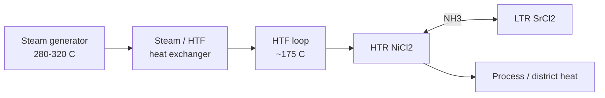

# SMR surplus heat utilization — 40 MWe PWR-class concept

Open model: [github.com/alishsan/tces](https://github.com/alishsan/tces)

## Plant basis

| Parameter | Value | Notes |
|-----------|-------|--------|
| Net electric power | **40 MWe** | Representative small modular unit |
| Net thermal efficiency | **~33%** | Illustrative \(P_\mathrm{th} \approx P_e / \eta_\mathrm{el}\) |
| Derived thermal power | **~121 MW_th** | Order-of-magnitude for sizing |
| Secondary steam (PWR-class) | **280–320 °C** | Typical SG outlet / main steam range |
| Saturation pressure (~280 °C) | **~7 MPa** | From water property correlation in `tces.smr` |

This is **balance-of-plant (BOP) cogeneration**, not a safety-related heat removal path.

## Role of thermochemical resorption (TCES)

When the SMR is **electricity-priority** (grid curtailment, load following, startup), a fraction of **secondary-side thermal power** is surplus. TCES can:

1. **Store** it as chemical potential (NiCl₂ / SrCl₂ ammoniates).
2. **Release** later as process or district heat (`:direct` mode).
3. **Upgrade** delivery temperature relative to the charge loop (`:upgrade` mode).
4. Optionally provide **combined heat and cold** (`:combined` mode) for hybrid energy parks.

Reference technology: Yan et al. (2020), *Appl. Therm. Eng.* 167, 114800 — implemented in this repository.

## Critical integration point: steam temperature vs salt limit

PWR **main steam at 280–320 °C cannot charge** the reference **NiCl₂–SrCl₂/NH₃** pair directly. The lumped model (Table 1) requires HTR charging at **T_in ≈ 168 °C** (with **T_deH ≈ 163 °C** and **θ ≈ 5 °C** driving difference).



**Recommended architecture**

- Extract heat from steam (or a parallel steam line) through a **temperature-stepping HX** into a closed **heat transfer fluid (HTF) loop** at **~160–180 °C** (default scenario: **175 °C**).
- Charge the **high-temperature reactor (HTR)** from that loop.
- Keep ammonia and salts in a **non-safety-class**, segregated building with conventional industrial containment practice.

Alternative long-term options (not in the current simulator): higher-temperature salt pairs or cascaded stages for closer coupling to main steam.

## Default surplus-heat scenario (code)

Run:

```bash
lein run smr
```

Defaults (`tces.smr/default-40mwe-pwr`):

| Parameter | Value |
|-----------|--------|
| Surplus thermal power | **15% × 121 ≈ 18 MW_th** |
| Surplus duration | **6 h** |
| Energy to storage window | **~109 MWh_th (~392 GJ)** |
| Delivery target | **70–150 °C** |
| Model conversion **X** | **0.85** |
| Metal ratio **μ** | **8** |

The tool recommends **`:upgrade`** for 150 °C delivery (above direct-mode **144 °C** discharge cap, below upgrade **187 °C** cap).

Illustrative sizing (lumped, single-cycle equivalent):

- **COPh ≈ 0.53** (upgrade mode at X = 0.85)
- **γ_h ≈ 1400 kJ/kg** (PRS basis)
- **NiCl₂ inventory (PRS basis) ~280 t** for one full discharge of the 6 h surplus window (scale ∝ energy; reduce with partial cycles or higher X)

Treat masses as **order-of-magnitude** until dynamic charge time and kinetics are added.

## Operating mode selection

| Mode | Use when | 40 MWe example (150 °C delivery) |
|------|----------|----------------------------------|
| `:direct` | Delivery ≤ ~144 °C | Not selected |
| `:upgrade` | Need higher T than direct | **Recommended** |
| `:combined` | Need heat + refrigeration | Optional (data center, HVAC) |

## Nuclear licensing narrative (outline)

- **Safety class**: TCES on a **tertiary / BOP** branch; failure → loss of cogeneration revenue, not core heat removal.
- **Ammonia**: Closed loop; design parallels industrial ammonia heat pumps; QRA and leak detection required.
- **Materials**: Solid salts at near-atmospheric pressure in HTR/LTR vessels; modular skids.
- **Defense in depth**: Isolation valves, steam trip interlocks, no direct containment penetration by NH₃.

## Roadmap for the repository

1. **Transient charge/discharge** — link MW_th to real cycle time vs X.
2. **HTF ↔ HTR** effectiveness and pinch in the steam HX.
3. **Techno-economics** — $/GJ stored vs molten-salt sensible tank.
4. **Salt pair library** — screen pairs for 200 °C+ charge without steam stepping.

## References

- Yan, Kuai, Wu (2020) — NiCl₂–SrCl₂/NH₃ multi-mode transformer (model basis).
- IAEA / OECD-NEA SMR cogeneration and non-electrical applications (context).
- Cabeza et al. — sorption TES reviews (competing technologies).
